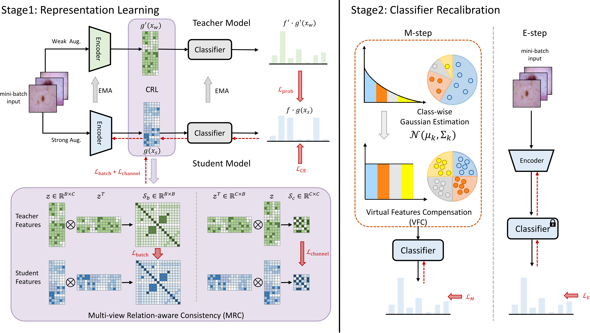

# MRC-VFC

[MICCAI 2023] This is the official repository of our paper [**Combat Long-tails in Medical Classification with Relation-aware Consistency and Virtual Features Compensation**](https://peterlipan.github.io/data/MICCAI_23_Li_camera_ready.pdf).



# Requirements

isic-cli (https://github.com/ImageMarkup/isic-cli)

torch==1.12.0

torchvision==0.13.0

wandb==0.13.5

torchsampler==0.1.2

scikit-image==0.19.3

imbalanced-learn==0.9.0

albumentations==1.3.0

scikit-learn==1.0.2


## Dataset preparation

To start with, download the official ISIC datasets and split them into train/val/test:

```bash
# ISIC 2019
bash ./prepare_datasets/ISIC2019LT/download_ISIC2019.sh

# ISIC Archive
bash ./prepare_datasets/ISIC_Archive/download_isic_archive.sh
python ./prepare_datasets/ISIC_Archive/merge.py
```


## Stage 1 - Multi-view Relation-aware Consistency

The first-stage training with the MRC module. The model weights will be saved to './checkpoints'.

```bash
python stage1.py
```
* If you are going to use the wandb to log the training process, please replace wandb.login(key="[Your wandb key here]") with your own key.


## Stage 2 - Virtual Feature Compensation

The second-stage training with the VFC module. 

```bash
python stage2.py
```


# Citation

```
@inproceedings{pan2023combat,
  title={Combat Long-Tails in Medical Classification with Relation-Aware Consistency and Virtual Features Compensation},
  author={Pan, Li and Zhang, Yupei and Yang, Qiushi and Li, Tan and Chen, Zhen},
  booktitle={International Conference on Medical Image Computing and Computer-Assisted Intervention},
  pages={14--23},
  year={2023},
  organization={Springer}
}
```
